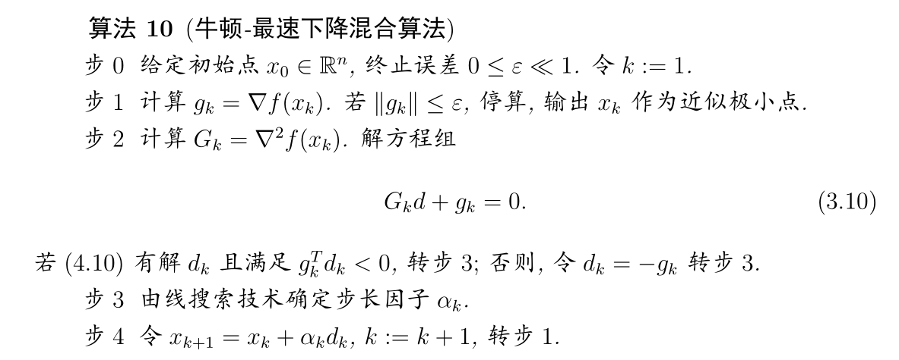

# 最优化方法——牛顿法

实验环境：

MATLAB 2019b

关键思想：

***二次函数近似***

## 阻尼牛顿法

收敛速度比较快，但是难以保证函数的Hesse阵$G(x)=\nabla ^2f(x) $在每个迭代处$x_k$是正定的.(常常会显示该矩阵接近奇异值，缩放错误或者说牛顿方向并不是下降方向)

## 修正牛顿法

### 1.牛顿-最速下降混合算法

在收敛速度较快的同时还解决了正定的问题

### 2.修正牛顿法

收敛速度比较慢，因为$G_k+\mu_k I$ 只是函数的Hesee阵 $G_k$ 一个近似